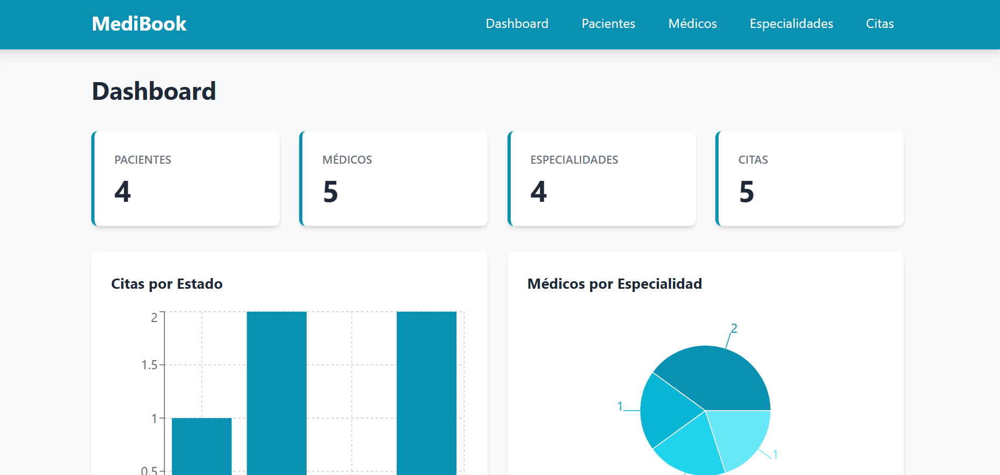
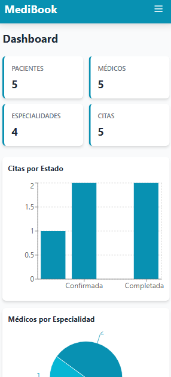
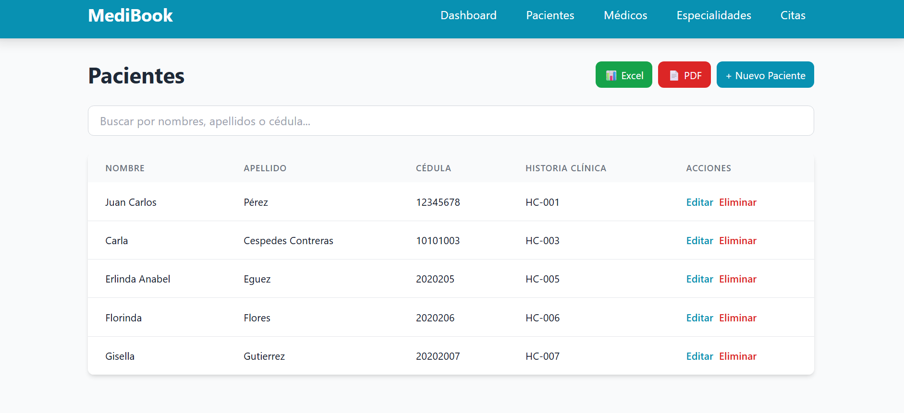
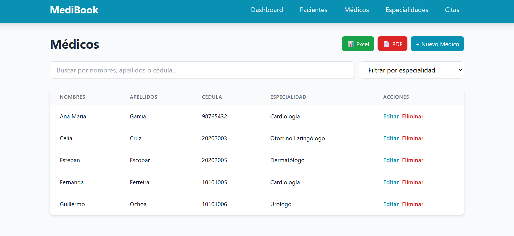
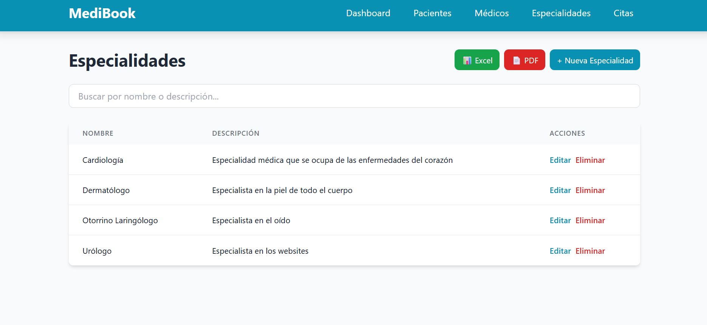
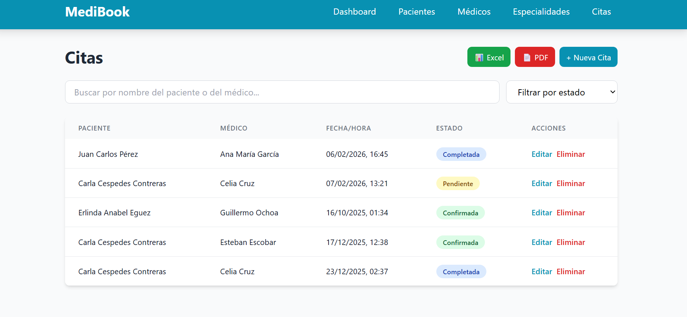
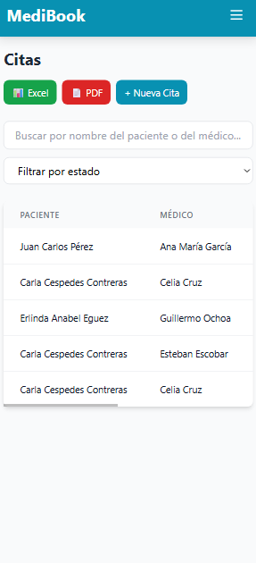
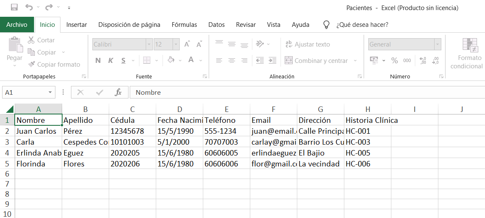

# 🏥 MediBook - Frontend

Interfaz web moderna para sistema de gestión de citas médicas. Desarrollado con React, Vite y Tailwind CSS.

## 🔗 Proyecto Completo

Este es el **frontend** del sistema MediBook. Para ver el proyecto completo:
- **Backend (.NET API)**: https://github.com/Fr3ak-Dev/MediBook-Api

## 🚀 Características

- ✅ **Dashboard Interactivo** con 3 gráficos:
  - Citas por estado (barras)
  - Médicos por especialidad (circular)
  - Tendencia de citas (línea temporal)
- ✅ **CRUD Completo** para Pacientes, Médicos, Especialidades y Citas
- ✅ **Búsqueda en Tiempo Real** en todas las entidades
- ✅ **Filtros Avanzados** (por estado, especialidad, etc.)
- ✅ **Validaciones de Formularios** (email, cédula, teléfono)
- ✅ **Exportación de Datos**:
  - Excel (.xlsx)
  - PDF con tablas formateadas
- ✅ **Notificaciones Toast** para confirmar acciones
- ✅ **Loading States** con spinners animados
- ✅ **Badges de Estado** con colores (Pendiente, Confirmada, etc.)
- ✅ **Diseño Responsivo** con Tailwind CSS

## 🛠️ Tecnologías

- **React 18** - Librería de UI
- **Vite** - Build tool
- **Tailwind CSS** - Estilos
- **React Router DOM** - Navegación
- **Axios** - Cliente HTTP
- **Recharts** - Gráficos
- **jsPDF + autoTable** - Exportación PDF
- **SheetJS (xlsx)** - Exportación Excel
- **React Hot Toast** - Notificaciones

## 📋 Requisitos Previos

- [Node.js 18+](https://nodejs.org/)
- Backend API corriendo en `http://localhost:5154`

## 🔧 Instalación y Ejecución

### 1. Clonar el repositorio
```bash
git clone https://github.com/Fr3ak-Dev/MediBook-Frontend
cd MediBookFrontend
```

### 2. Instalar dependencias
```bash
npm install
```

### 3. Ejecutar la aplicación
```bash
npm run dev
```

La aplicación estará disponible en `http://localhost:5173`

## 📁 Estructura del Proyecto
```
MediBookFrontend/
├── src/
│   ├── components/          # Componentes reutilizables
│   │   ├── Layout.jsx
│   │   └── Navbar.jsx
│   ├── pages/              # Páginas principales
│   │   ├── Dashboard.jsx
│   │   ├── Pacientes.jsx
│   │   ├── Medicos.jsx
│   │   ├── Especialidades.jsx
│   │   └── Citas.jsx
│   ├── services/           # Servicios API
│   │   └── api.js
│   ├── App.jsx
│   ├── main.jsx
│   └── index.css
└── public/
```

## 🎨 Paleta de Colores

- **Primario**: Cyan-600 (`#0891b2`) - Botones, acentos
- **Éxito**: Green-600 - Exportar Excel
- **Error**: Red-600 - Eliminar, errores
- **Info**: Blue-600 - Estados completados
- **Advertencia**: Yellow-600 - Estados pendientes

## 🔌 Conexión con Backend

La configuración de la API está en `src/services/api.js`:
```javascript
const api = axios.create({
  baseURL: 'http://localhost:5154/api',
});
```

## 🎨 Capturas de Pantalla

### Dashboard con Gráficos



### Estadísticas y Tendencias


### Gestión de Pacientes


### Gestión de Médicos


### Gestión de Especialidades


### Gestión de Citas



### Exportación a Excel


### Exportación a PDF
